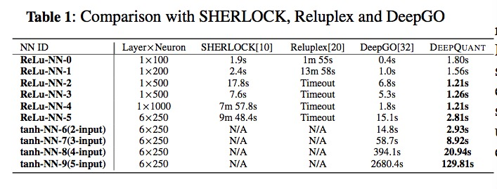
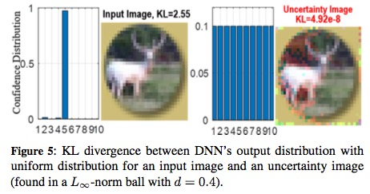

# DeepQuant
Towards the Quantification of Safety Risks inDeep Neural Networks

# Datesets

(1) ACSC-Xu

(2) MNIST

(3) CIFAR-10

(4) ImageNet

# Software

1: Matlab 2018b

2: Neural Network Toolbox

3: Image Processing Toolbox

4: Parallel Computing Toolbox

# Run

Folder "ACSC_XU_NN_Robustness" contains two robustness metrics methods for ACSC_XU dataset.

Folder "Decision Reachability" contains ReLu and Tanh neural networks.
 
Folder "MNIST_NN_Oscillation" contains the oscillation examples for MNIST.

# Sample Results

